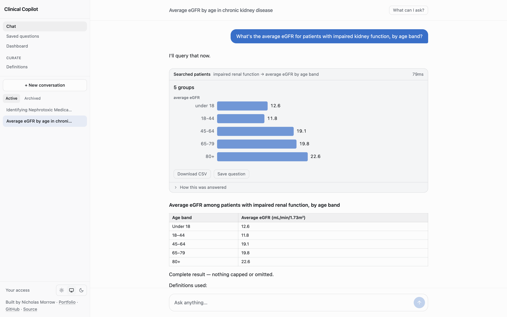
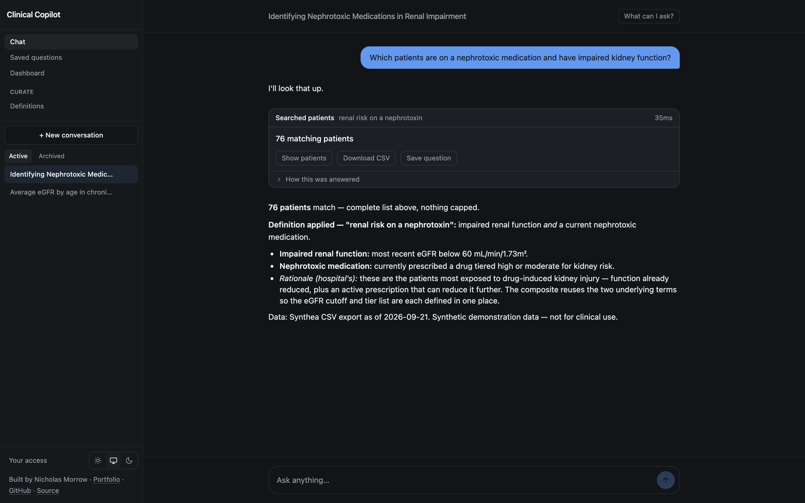
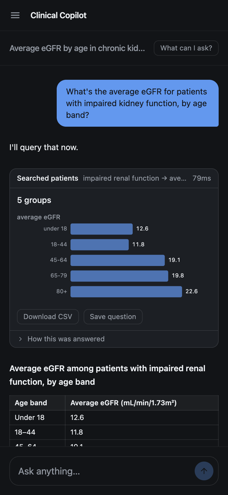
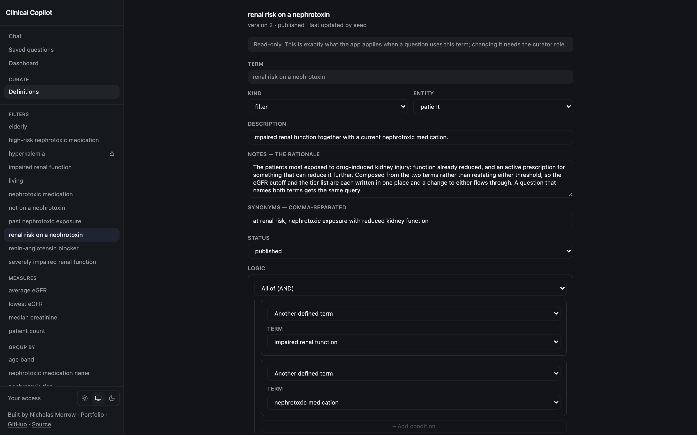

# Clinical Copilot

[](https://github.com/nickjmorrow/clinical-copilot/actions/workflows/ci.yml)

A chat app that answers clinical questions about a hospital's patients in plain
English — and does **not** let the model write the SQL.

**Live demo: [204-168-227-216.sslip.io](https://204-168-227-216.sslip.io)** —
try *"Which patients are on a nephrotoxic medication and have impaired kidney
function?"* All data is synthetic, and usage is rate-limited per visitor.

<picture>
  <source media="(prefers-color-scheme: dark)" srcset="docs/screenshots/aggregate-dark.png">
  
</picture>

The model's job is to decide which of the hospital's *defined clinical terms* a
question refers to: a filter to narrow a cohort, a measure to aggregate over
it, a dimension to group it by. What "impaired renal function" means is a row
in a database table, reviewed once, with its justification attached and
editable through its own UI. A deterministic layer turns resolved terms into
parameterised SQL, and it is the only code here that writes any.

**Every patient in this project is synthetic**, generated by
[Synthea](https://synthetichealth.github.io/synthea/) — 2,271 of them, with
real LOINC-coded lab results and RxNorm-coded prescriptions, not hand-rolled
rows. It is a demonstration, not a clinical decision support tool.

- [WRITEUP.md](./docs/WRITEUP.md) — why it is built this way, in 500 words
- [DEMO.md](./docs/DEMO.md) — a script you can follow cold
- [DATA_MODEL.md](./docs/DATA_MODEL.md) — the schema, as a diagram and as psql
- [CONVENTIONS.md § The definitions layer](./CONVENTIONS.md#the-definitions-layer) — the
  architecture, and the two rules holding it up
- [SEMANTIC_LAYER.md](./docs/SEMANTIC_LAYER.md) — what a semantic-model product has
  that this does not, and the order to add it in
- [OPERATING.md](./docs/OPERATING.md) — deploying, day-to-day commands and troubleshooting

Postgres + FastAPI + React + a worker, four containers, one command. The
scaffolding came from a reference architecture template; the conventions it
brought — and the ones this project added — live in [CONVENTIONS.md](./CONVENTIONS.md).

## Design decisions and trade-offs

- **The model chooses terms; code writes the SQL.** The LLM maps a question to
  the hospital's defined terms, and a deterministic assembler turns them into
  parameterised SQL — the only code that writes a clinical query. Every answer
  cites the definitions it used, and no query can contain a threshold the
  model made up. *Trade-off:* it can only answer what the vocabulary can
  express; an unknown term gets a clarifying question, not a guess, and a new
  kind of question needs a new definition.
  [More](./CONVENTIONS.md#the-definitions-layer)
- **Definitions are validated data, not SQL snippets.** Each term is structured
  JSON checked against a closed allowlist, versioned with a reason for every
  change, and editable without a deploy. *Trade-off:* a small DSL to maintain,
  far less expressive than SQL — deliberately.
- **The transcript is an append-only event log.** Messages, tool calls and tool
  results are rows; what the model sees and what the user sees are two
  different folds of the same log. *Trade-off:* every read is a replay, which
  is more machinery than a messages table.
  [More](./CONVENTIONS.md#the-transcript)
- **Generation runs in a separate worker, with Postgres as the queue.**
  `FOR UPDATE SKIP LOCKED` to claim, `LISTEN`/`NOTIFY` to stream tokens, no
  Redis. Closing the tab doesn't lose an answer. *Trade-off:* cancellation has
  to travel through the database, and a dead worker needs a sweeper to notice
  it. [More](./CONVENTIONS.md#the-worker)
- **Guardrails live in the data layer, not the prompt.** A column allowlist
  that never returns names or birth dates, row-level scope in every `WHERE`
  clause, and an audit row for every query — refusals included. *Trade-off:*
  some genuinely useful answers (a patient's name) are simply not available.
- **Architecture rules are tests.** Structural tests fail the build if, say,
  anything but the adapter imports the LLM SDK, or anything outside the
  definitions layer reads the clinical tables. *Trade-off:* repo-specific
  tests to maintain, in exchange for rules that can't quietly erode.
  [More](./CONVENTIONS.md#structural-tests)
- **A public demo without accounts.** Each browser gets an anonymous identity
  and its own conversations, bounded by per-visitor and daily cost limits.
  *Trade-off:* nothing follows you between devices, and the limits are checked
  between turns rather than mid-answer.

## Screenshots

<table>
  <tr>
    <td width="68%"></td>
    <td width="32%"></td>
  </tr>
  <tr>
    <td>A cohort question. The model picked one defined term; the answer names
    it and what it is made of, and the SQL behind it is one click away.</td>
    <td>On a phone, the sidebar becomes a menu.</td>
  </tr>
  <tr>
    <td colspan="2"></td>
  </tr>
  <tr>
    <td colspan="2">What a term means is a row, not a prompt. Anyone can open a definition
    and read exactly what the app applies — the logic, the reasoning, and every
    past version; only a curator can change one.</td>
  </tr>
</table>

## Quick start

Needs Docker, and [uv](https://docs.astral.sh/uv/) for the one seed step that
runs on the host (it installs the Python it needs). For development — the
checks and the pre-commit hook — run `scripts/setup.sh` once, which also wants
pnpm.

```bash
cp .env.example .env
# add your ANTHROPIC_API_KEY to .env — it is gitignored and never leaves the
# worker container

docker compose up -d
scripts/generate-synthea.sh                       # 2,271 patients, a few minutes
cd backend && uv run python -m app.seed --from ./data/synthea/csv
```

The seed is a separate step deliberately, and it runs on the host rather than
in a container: an app that writes patients into whatever database it finds
at startup is a bad default even for synthetic data, and the 380 MB export
`generate-synthea.sh` produces is gitignored and regenerated locally rather
than shipped. It loads 293 medications, 20 clinical definitions (11 filters, 4
measures, 5 dimensions), 2,271 patients, 110,870 prescriptions and 1,773,806
observations — under a minute, via Postgres `COPY` rather than batched
`INSERT`; see `app/services/seed_service.py`.

Then open <http://localhost:3000>. Refresh mid-answer — the conversation is
still there. Everything the development stack publishes on the host:

| Service | URL |
| --- | --- |
| Frontend | <http://localhost:3000> |
| Backend | <http://localhost:8000> |
| API docs | <http://localhost:8000/docs> |
| Postgres | `localhost:5433` (`app` / `app` / `app`) |

Ask it **"which patients are on a nephrotoxic medication and have impaired
kidney function?"** to see the whole idea at once: the model resolves that
question to the hospital's defined terms, a deterministic layer assembles the
SQL, and the answer — 76 patients, in the seeded dataset — arrives with the
definitions and the executed query beside it.

Then ask **"what's the average eGFR for those patients, by age band?"** The
same terms resolve a cohort, but naming a measure (`average eGFR`) and a
dimension (`age band`) turns the question into an aggregate instead of a
roster — the model does not compute the average itself, and the SQL is a
`GROUP BY` the assembler built from the same resolved predicates.

Then ask the follow-up, **"now just the ones over 65"**. The answer comes back
with a correction: the hospital defines `elderly` as *65 and over*, not
strictly over 65, and it says so — 35 patients, down from 76. It gets there by
querying again with `elderly` added rather than filtering the rows it already
had, which is both the honest boundary and a row in the audit log in its own
right.

Then ask for something long and **refresh the page while it is still writing**.
The answer keeps going. Generation runs in a worker process, not in your
request, so the browser is a viewer — close the tab, come back, and you pick up
where you left off.

Deploying, day-to-day commands and troubleshooting:
[docs/OPERATING.md](./docs/OPERATING.md).

## Stack

| Layer | Choice |
| --- | --- |
| Database | Postgres 17 |
| Backend | FastAPI, uvicorn, SQLAlchemy 2.0 async, asyncpg |
| Migrations | Alembic |
| Queue | Postgres — `FOR UPDATE SKIP LOCKED` + `LISTEN`/`NOTIFY`. No Redis. |
| Python deps | uv |
| LLM | Anthropic SDK, `claude-opus-5`, streaming, tool use |
| Logging | structlog |
| Frontend | React 19, Vite, TypeScript, Tailwind v4, TanStack Query |
| Node deps | pnpm |
| Tests | pytest (backend) — unit, structure, integration, plus a `live/` suite `check.sh` never runs; vitest (frontend) |
| Types | basedpyright (backend), tsc (frontend) |
| Lint | ruff (backend), eslint (frontend) — broad rule sets, individual rules off with a note |
| CI | GitHub Actions, running the same `scripts/check.sh` as the pre-commit hook |

## Project layout

```
backend/app/clinical/    The definitions layer: what a term may say, and the
                         assembler that turns terms into SQL. Nothing else
                         writes SQL for a clinical question.
backend/app/seed/        Loads a Synthea CSV export (synthea.py), plus the
                         curated clinical judgement Synthea does not supply:
                         which drugs are nephrotoxic and at what tier
                         (annotations.py), and the 20 clinical definitions
                         (reference_data.py).
backend/tests/support/eval_cases.py
                         The golden dataset. Read it as a document.
backend/tests/support/fixture.py, synthea/
                         A small, committed, real subset of the full Synthea
                         export — 111 patients, 11 of them found by querying
                         the live-seeded dataset for a specific clinical edge —
                         so the integration suite runs against real data
                         without needing the full 2,271-patient export.
                         Built by scripts/build-test-fixture.py.
backend/tests/live/      Needs a real model and an API key. check.sh never
                         runs it.
backend/alembic/         Migrations; versions/ is the schema's history
frontend/                React app
scripts/                 setup.sh and check.sh — the only two you run by hand
                         for everyday work — and deploy.sh, which ships it;
                         generate-synthea.sh and build-test-fixture.py are
                         one-time/occasional.
CONVENTIONS.md           The engineering conventions, and the reasoning behind each.
docs/WRITEUP.md          Why it is built this way, in 500 words.
docs/DEMO.md             A demo script you can follow cold.
docs/DATA_MODEL.md       The schema, as a diagram and as psql.
docs/SEMANTIC_LAYER.md   The gap list against a semantic-model product.
docs/OPERATING.md        Deploying, day-to-day commands, troubleshooting.
docs/screenshots/        The images in this README.
```

The transcript is stored as an append-only event log rather than a messages
table — one row per user message, model response, tool call, and tool result,
with everything on screen derived by replaying it. [CONVENTIONS.md § The
transcript](./CONVENTIONS.md#the-transcript) explains why that is the only shape that
survives contact with tools.

Generation runs in a worker process against a Postgres-backed queue, and the
streaming endpoint is a subscriber rather than the thing doing the work.
[CONVENTIONS.md § The worker](./CONVENTIONS.md#the-worker) covers claiming, cancellation,
the sweeper, and why the worker stays in its own process.

## What's deliberately not here

Pagination, a schedules UI, multi-user sharing, error tracking, prompt
caching. Each is cheap to add later and expensive to build before you need it,
and the seam each one needs already exists. [CONVENTIONS.md § What is
deliberately missing](./CONVENTIONS.md#what-is-deliberately-missing) says when
to add each.

**Caching of answers is not on that list — it is refused on purpose.** The
clinical definitions are cached; query results never are. Serving a cached
answer means serving yesterday's renal function to today's question, and the
patient whose eGFR has just fallen is precisely the one the query exists to
surface. No TTL makes that safe; it only decides how long the system is allowed
to be confidently wrong.

There is no sign-in. Locally everything runs as one dev user; the public demo
gives each browser an anonymous identity of its own. Adding a real identity
provider is one function — see [CONVENTIONS.md §
Identity](./CONVENTIONS.md#identity).

## Author

Built by Nicholas Morrow — [nickjmorrow.com](https://nickjmorrow.com) ·
[GitHub](https://github.com/nickjmorrow). MIT licensed; see [LICENSE](./LICENSE).
