# The data model

Seventeen tables: twelve for the clinical domain, and five the chat app itself
uses. The source of truth is [`backend/app/models.py`](../backend/app/models.py)
— Alembic generates migrations by diffing it, so anything not declared there
does not exist.

This file is the picture. When they disagree, `models.py` is right.

## The clinical tables

```mermaid
erDiagram
    patients ||--o{ prescriptions : "has"
    patients ||--o{ observations : "has"
    medications ||--o{ prescriptions : "appears in"
    medications ||--o| medication_annotations : "annotated by code"
    conversations ||--o{ query_audit : "SET NULL on delete"

    patients {
        uuid id PK
        text source_id UK "Synthea's own id - PHI, restricted"
        text full_name "PHI - never returned"
        date birth_date "PHI - never returned, age derived from it"
        date death_date "NULL means alive"
        text sex "female|male|other|unknown"
        text race
        text state
        text ssn "PHI - loaded, never returned"
        text drivers "PHI - loaded, never returned"
        text passport "PHI - loaded, never returned"
        text address "PHI - loaded, never returned"
    }

    medications {
        uuid id PK
        text code UK "RxNorm"
        text system
        text display
    }

    medication_annotations {
        uuid id PK
        text code "RxNorm - keyed by code, not FK, so a reload never loses it"
        text attribute "nephrotoxic_risk today; open to more"
        text value "high|moderate|contextual"
        text rationale "NOT NULL - why this drug, this tier"
    }

    prescriptions {
        uuid id PK
        uuid patient_id FK "CASCADE"
        uuid medication_id FK "RESTRICT"
        date start_date
        date end_date "NULL means open - not always 'still taking'"
    }

    observations {
        uuid id PK
        uuid patient_id FK "CASCADE"
        text category "laboratory|vital-signs|survey"
        text code "LOINC"
        numeric value_numeric "a threshold reads only this"
        text value_text "the qualitative rest"
        text unit
        timestamptz taken_at "time series - latest per code is what counts"
    }

    observation_catalog {
        uuid id PK
        text code UK "LOINC - what a definition's codes validate against"
        text display
        text unit "commonest unit, for display"
        jsonb units "every unit this code was seen in"
        int observation_count
        int patient_count
        bool is_numeric
    }

    clinical_definitions {
        uuid id PK
        text term UK "'impaired renal function'"
        text kind "filter|measure|dimension"
        text entity "which table the predicate reads"
        text description
        jsonb logic "structured predicate, NEVER a SQL fragment"
        text notes "NOT NULL - the justification"
        jsonb synonyms "what the model may say instead"
        text status "draft|published|deprecated"
        int version "bumped on every edit"
    }

    dataset_meta {
        uuid id PK
        text source
        date as_of_date "the dataset's own 'today' - ages are relative to this"
        int patient_count
    }

    query_audit {
        uuid id PK
        uuid conversation_id FK "SET NULL - outlives the chat"
        text asked_by
        text raw_question
        jsonb resolved_terms
        text executed_sql
        jsonb columns_touched "includes columns READ, not just returned"
        int row_count
        text outcome "answered|clarification_requested|rejected|error"
        text rejection_reason "NOT NULL iff outcome is rejected or error"
        jsonb measures "empty for a plain cohort listing"
        jsonb group_by
    }
```



`clinical_definitions` has no foreign keys and that is the point: it describes
the other tables rather than joining to them. `app/clinical/assembler.py` is
what connects a definition to the columns it talks about, and it is the only
thing that does.

Three tables sit beside the diagram rather than in it, because all three are
satellite records rather than part of the running example:
**`clinical_definition_history`** is one append-only row per change to a
definition — not a foreign key to
`clinical_definitions.id`, deliberately, so deleting a term does not delete the
record of what it used to say. **`saved_questions`** stores `terms`/`measures`/
`group_by` by name, never rows or SQL, so reopening one re-runs it through
whatever the definitions say today. **`user_roles`** is the authorization seam:
`roles`, which open the curator and auditor surfaces, and `scope_states`, a
list of US states a user's queries are confined to (`NULL` means unconfined),
applied by the assembler the same way every other predicate is.

## The five that carry the design

**`patients` carries every identifier Synthea issues, not just the ones this
app needs.** An SSN, a driving licence and a passport sit beside the name and
birth date, all loaded, none returnable — `app/clinical/columns.py` is the
allowlist that keeps them out of an answer. A restriction that works because
the sensitive column was never loaded proves nothing; this one has something
to fail on.

**`medications` is thin; the clinical judgement lives in
`medication_annotations`, keyed by code rather than by a foreign key.** Synthea
supplies an RxNorm code and a display name and asserts nothing about kidney
risk — "vancomycin is high-risk" is a review decision, with its `rationale`
required the same way a `clinical_definitions.notes` is. Keying by code rather
than `medications.id` means the annotations survive a reload of the patient
data; reference knowledge about drugs should not be destroyed by reimporting
patients.

**`medication_annotations.value` is a tier, not a boolean.** `contextual`
means ACE inhibitors and ARBs — they lower measured eGFR through efferent
arteriolar dilation rather than injury, and are prescribed *for* kidney
protection. `nephrotoxic medication` resolves to `high` and `moderate` only;
`contextual` is reachable through `renin-angiotensin blocker` instead.

**`prescriptions.end_date IS NULL` means the prescription is open — not
reliably "currently taking".** Whether a generator closes a finished course is
a property of the export, so a definition states its own `exposure`
(`active`, `recent`, `ever`) rather than the query layer assuming one for
every dataset.

**`observations` is a time series, keyed by a world-agreed code, not a string
this project chose.** `code = '33914-3'` is eGFR regardless of which system
produced it; the old schema's `test_name = 'egfr'` was a string this project
invented. `observations_patient_code_taken_idx` answers "their latest X"
without a sort, and `observation_catalog` is what a definition's `codes` are
validated against at *load* time — referencing a code nobody measured is a
loud failure there, not a silently empty answer at query time.

## Looking at it directly

```bash
docker compose exec db psql -U app -d app
```

```sql
\dt                     -- all tables
\d+ patients            -- one table: columns, indexes, constraints, FKs
\d+ clinical_definitions
```

Every column, every clinical table, one query:

```bash
docker compose exec db psql -U app -d app -c "
select c.relname as tbl, a.attname as col,
       format_type(a.atttypid, a.atttypmod) as type
from pg_class c
join pg_namespace n on n.oid = c.relnamespace
join pg_attribute a on a.attrelid = c.oid and a.attnum > 0 and not a.attisdropped
where n.nspname='public' and c.relkind='r'
  and c.relname in ('patients','medications','medication_annotations',
                    'prescriptions','observations','observation_catalog',
                    'clinical_definitions','clinical_definition_history',
                    'dataset_meta','query_audit','saved_questions','user_roles')
order by c.relname, a.attnum;"
```

The constraints are usually the interesting part — they encode the rules:

```bash
docker compose exec db psql -U app -d app -c "
select conrelid::regclass as tbl, conname, pg_get_constraintdef(oid)
from pg_constraint
where connamespace='public'::regnamespace and contype='c'
order by conrelid::regclass::text;"
```

## What the data actually contains

Real counts, seeded from the export `scripts/generate-synthea.sh` produces
(`-p 2000 -s 20260921`; Synthea keeps generating until the *living* population
reaches the target, so the export ends up larger — 2,271 patients, 271 of them
deceased):

```bash
docker compose exec db psql -U app -d app -c "
select 'patients' t, count(*) from patients
union all select 'medications', count(*) from medications
union all select 'medication_annotations', count(*) from medication_annotations
union all select 'prescriptions', count(*) from prescriptions
union all select 'observations', count(*) from observations
union all select 'observation_catalog', count(*) from observation_catalog
union all select 'definitions', count(*) from clinical_definitions
union all select 'audit rows', count(*) from query_audit;"
```

| table | count |
| --- | --- |
| patients | 2,271 |
| medications | 293 |
| medication_annotations | 49 (all `nephrotoxic_risk`: `high`/`moderate`/`contextual`) |
| prescriptions | 110,870 |
| observations | 1,773,806 |
| observation_catalog | 280 distinct LOINC codes |
| clinical_definitions | 20 (11 filters, 4 measures, 5 dimensions) |
| audit rows | however many questions have been asked since the last reset |

The twenty defined terms and what they mean:

```bash
docker compose exec db psql -U app -d app -c \
  "select term, kind, description, logic from clinical_definitions order by kind, term;"
```

Real cohort sizes, computed by the query service itself rather than assumed —
"given the right terms, is the answer right" is exactly what
`backend/tests/integration/test_eval.py` checks, against a smaller committed
fixture with the same shape:

| terms | patients |
| --- | --- |
| `impaired renal function` | 244 |
| `severely impaired renal function` | 197 |
| `nephrotoxic medication` | 355 |
| `high-risk nephrotoxic medication` | 33 |
| `elderly` | 376 |
| `living` | 2,000 |
| `renin-angiotensin blocker` | 423 |
| `impaired renal function` ∩ `nephrotoxic medication` (the running example) | 76 |
| + `elderly` | 35 |
| `elderly` ∩ `high-risk nephrotoxic medication` | 9 |
| `hyperkalemia` ∩ `renin-angiotensin blocker` | **0** — a real finding, not a bug; see [WRITEUP.md](./WRITEUP.md) |

The eleven anchor patients in the **test** fixture — each found by querying the
live-seeded dataset for a specific edge, not hand-designed — are documented in
[`scripts/build-test-fixture.py`](../scripts/build-test-fixture.py) with the
evidence that earned each one a place, and named in
[`backend/tests/support/fixture.py`](../backend/tests/support/fixture.py).

## The app's own tables

`conversations`, `event_records`, `tasks` and `schedules` began as the
template's and have grown since. `event_records` is the append-only transcript —
one row per user message, assistant response, tool call and tool result, with
everything on screen derived by replaying it. See
[CONVENTIONS.md § The transcript](../CONVENTIONS.md#the-transcript).
`conversations` gained `pinned_at`, `archived_at` and `title_custom` for the
sidebar's controls ([CONVENTIONS.md § Conversation
controls](../CONVENTIONS.md#conversation-controls)), and `tasks` gained
`request_id`, so a turn's worker logs join to the API request that enqueued it.

**`usage_events`** is the fifth, and the ledger the cost ceilings are counted
from: one row per metered use — `kind` is `message` (a user sent one, `amount`
1) or `tokens` (the worker recorded a model call, `amount` its input plus
output tokens) — with `user_id` and `created_at`. It has no foreign key to
anything a user can delete, deliberately: counted from the transcript instead,
deleting a conversation would reset a visitor's hourly limit and hand back the
tokens spent in it. Every read and write goes through
`services/usage_service.py`.
